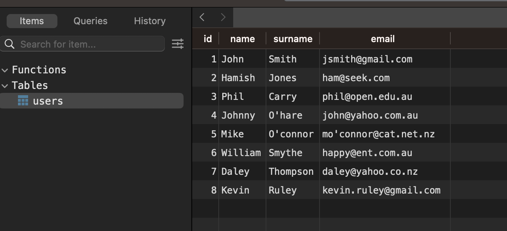
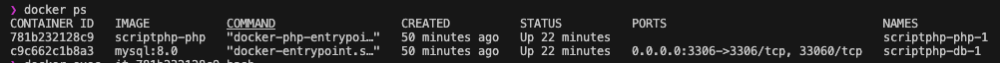
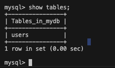
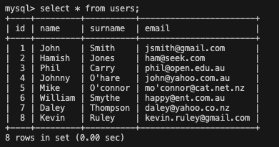

Create a PHP script, that is executed from the command line, which accepts a CSV file as input and processes the CSV file.

# Prerequisite
- PHP version: 8.1+
- MySQL version 8+
- Installed Docker

# Installation
```bash
git clone https://github.com/Siyi-C/scriptPHP.git
```
# Database Credential
Copy env.example to your env file and copy below credential

If you run script inside docker container
```bash 
MYSQL_ROOT_PASSWORD=password
DB_HOST=db 
MYSQL_DATABASE=mydb
MYSQL_USER=user
MYSQL_PASSWORD=password
```

OR If you run script outside from docker container
```bash 
MYSQL_ROOT_PASSWORD=password
DB_HOST=127.0.0.1 
MYSQL_DATABASE=mydb
MYSQL_USER=user
MYSQL_PASSWORD=password
```

# Build and Run the script
```bash
composer install
```

```bash 
docker compose up --build
```

## CLI Usage outside docker container
```bash 
php user_upload.php --create_table -u user -h 127.0.0.1 -p password
```

```bash
php user_upload.php --create_table -u user -h 127.0.0.1 -p password  --dry_run
```

```bash
php user_upload.php --file users.csv -u user -h 127.0.0.1 -p password
```

```bash
php user_upload.php --file users.csv -u user -h 127.0.0.1 -p password --dry_run
```

### Output: 
<p align="center">
  
</p>


## If you run a script inside docker container,
```bash 
docker ps 
```
You will see the container list.

<p align="center">
  
</p>

Copy the scriptphp-php container id 
```bash
docker exec -it [past_scriptphp-php_container_id_here] bash
```
You are now inside the Docker container. 

## CLI Usage inside docker container
```bash
php user_upload.php --help
```

```bash
php user_upload.php --create_table
```

```bash
php user_upload.php --create_table --dry_run
```

```bash
php user_upload.php --file users.csv
```

```bash
php user_upload.php --file users.csv --dry_run
```

## Enter Database inside container
```bash
docker ps
```

Copy mysql:8.0 container id
```bash 
docker exec -it [past_mysql_container_id] bash
```

```bash
mysql -u user -h db -p
```
then enter password

```bash
show databases;
```

```bash
use mydb;;
```

```bash
show tables;
```

### If you create user table already, it will show:
<p align="center">
  
</p>


### If you insert users already, it will show:
<p align="center">
  
</p>
